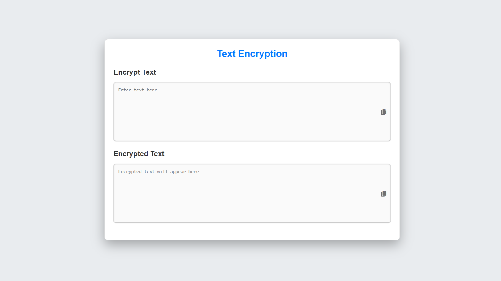
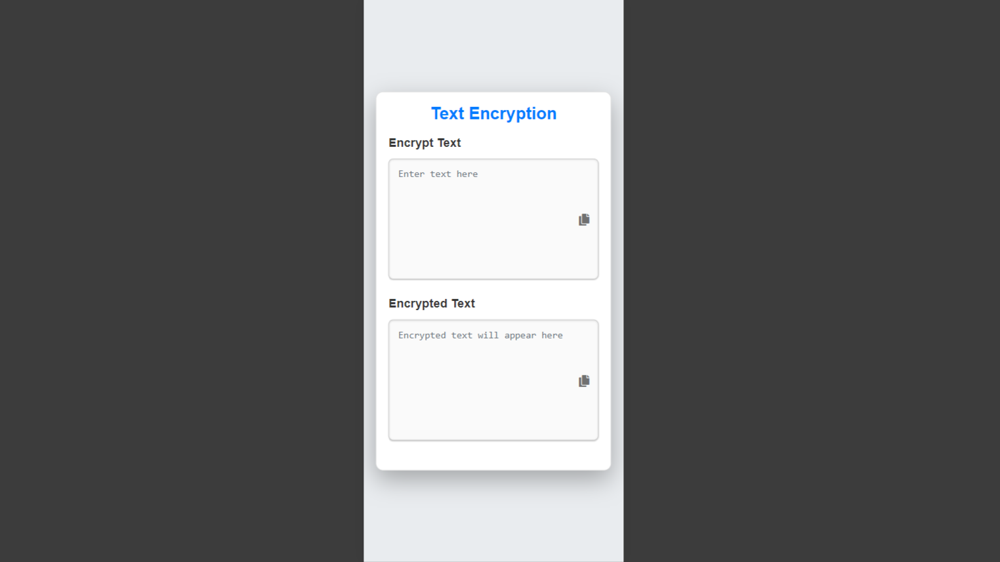

# 🔐 JavaScript Text Encryption

This is a **simple web application** that allows users to **encrypt and decrypt text** using **AES encryption**. The application is built with **HTML, CSS, and JavaScript**.

## 📸 Preview

### 💻 Desktop


### 📱 Mobile


## ✨ Features 

- 🔒 **Text Encryption**: Enter any text to **securely encrypt** it.
- 🔑 **Text Decryption**: Encrypted text can be **decoded back** to its original form.
- 📋 **Copy to Clipboard**: Easily copy the text or encrypted text **with a single click**.

## 🚀 Installation

### 📥 Downloading the Project

1. **Clone the Repository**:  
   Use the following command in your terminal to clone the repository to your local machine:
   ```bash
   git clone https://github.com/Iqbolshoh/javascript-text-encryption.git
   ```

2. **Download as ZIP**:  
   Alternatively, you can download the project as a ZIP file directly from GitHub:
   - 🔗 Go to the [repository page](https://github.com/Iqbolshoh/javascript-text-encryption).
   - 🟢 Click the **"Code"** button.
   - 📥 Select **"Download ZIP"** to download the entire project as a ZIP file.
   - 📂 Extract the contents of the ZIP file to a folder on your computer.

### 🏃 Running the Project

1. 📁 Navigate to the project directory.
2. 🌐 Open the **`index.html`** file in your web browser.

## 🛠 Usage

1. 🔒 **Encrypting Text**:
   - 📝 Type or paste your text into the **first text area**.
   - 🔐 The encrypted text will automatically appear in the **second text area**.

2. 🔑 **Decrypting Text**:
   - 📝 Paste the encrypted text into the **second text area**.
   - 🔓 The original text will automatically appear in the **first text area**.

3. 📋 **Copying Text**:
   - 👆 Click the **copy icon** next to the text area to **copy the text** to your clipboard.

## 🖥 Technologies Used


## 📜 License
This project is open-source and available under the **MIT License**.

## 🤝 Contributing  
🎯 Contributions are welcome! If you have suggestions or want to enhance the project, feel free to fork the repository and submit a pull request.

## 📬 Connect with Me  
💬 I love meeting new people and discussing tech, business, and creative ideas. Let’s connect! You can reach me on these platforms:

<div align="center">
  <table>
    <tr>
      <td>
        <a href="https://iqbolshoh.uz" target="_blank">
          
        </a>
      </td>
      <td>
        <a href="mailto:iilhomjonov777@gmail.com" target="_blank">
          
        </a>
      </td>
      <td>
        <a href="https://github.com/iqbolshoh" target="_blank">
          
        </a>
      </td>
      <td>
        <a href="https://www.linkedin.com/in/iqbolshoh/" target="_blank">
          
        </a>
      </td>
      <td>
        <a href="https://t.me/iqbolshoh_777" target="_blank">
          
        </a>
      </td>
      <td>
        <a href="https://wa.me/998997799333" target="_blank">
          
        </a>
      </td>
      <td>
        <a href="https://instagram.com/iqbolshoh_777" target="_blank">
          
        </a>
      </td>
      <td>
        <a href="https://x.com/iqbolshoh_777" target="_blank">
          
        </a>
      </td>
      <td>
        <a href="https://www.youtube.com/@Iqbolshoh_777" target="_blank">
          
        </a>
      </td>
    </tr>
  </table>
</div>
